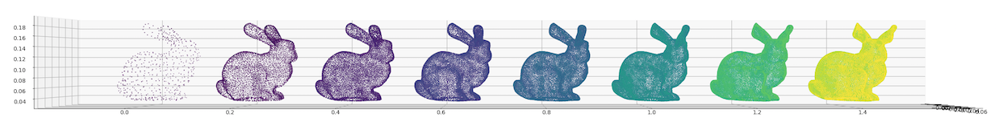

# Vertices

> Extract fixed-size vertex data from .obj and .jpg files



## Installation

```bash
pip install vertices
```

## 3D Usage

To extract 3D vertices from an .obj file:

```python
from vertices import ObjParser

# parse an object file
obj = ObjParser('bunny.obj')

# get the default vertices in the loaded obj file
verts = obj.vertices

# get a specified number of vertices from the obj file
verts = obj.get_n_vertices(10000)
```

This process will recursively subdivide faces until the desired number of vertices are accumulated.

The returned object will be a numpy array with shape (10000, 3).

## 2D Usage

To extract 2D vertices from a .jpg file:

```python
from vertices import ImgParser

# parse an input image file
img = ImgParser('dylan.jpg')

# get the default number of vertices identified in the image file
verts = img.vertices

# get a specified number of vertices from the jpg file
verts = img.get_n_vertices(10000)
```

The returned object will be a numpy array with shape (10000, 2).